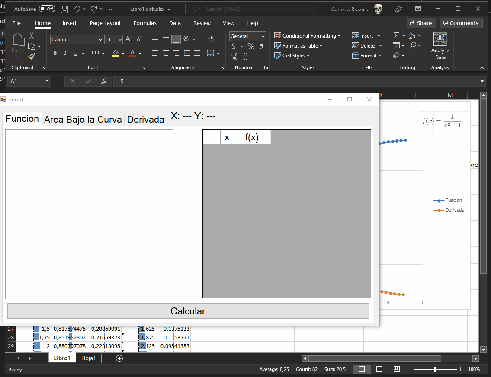

Este repositorio alberga alguna clase que impartí mientras ejercía mis Practicas pre-profesionales como Ayudante de Cátedra asignatura de Programación2 cuando estaba de estudiante en la Universidad UTE (ósea como hace un montón).

Espero este repositorio sirva para aquellas personas que quieran revisar material con WindowsForms y C#.

Este proyecto fue una clase extra dentro del pensum para aquel entonces, donde hice uso de Eventos para dibujar y cálculos de área bajo la curva y derivación. Con la idea de que el estudiantado de aquel entonces pueda usarlo en sus proyectos para final de semestre.

## Observaciones:
Es probable que este material esté un poco desactualizado, ya que lo creé hace ya unos años atrás.

- # Cómo Usarlo

  Pues, solo es cuestión de copiar de Excel 2 columnas (Columna1 valores de x, Columna2 valores de f(x)) y pegar en el RichTextBox.

  

Mi Objetivo al dar esta clase fue que en proyectos finales de semestre Incluyendo lectura de sensores, puedan determinar el comportamiento de ciertas plantas, o aplicar ciertos criterios a partir de la derivación de una función discreta.